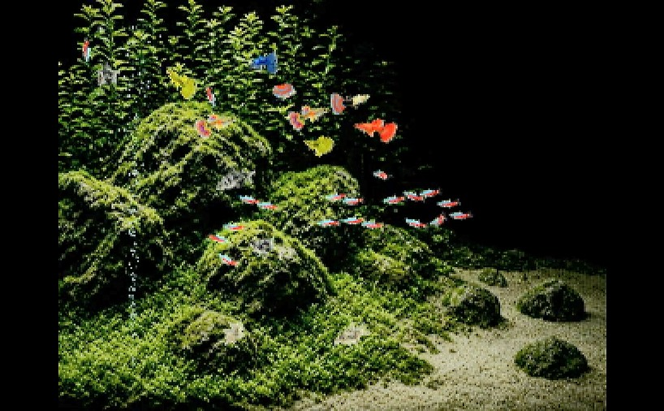

# Aquarium Espresso

ESP32-S3 + ST7789 (320x240 横向き) で小さな熱帯魚水槽を再現します。

魚種はグッピー、ネオンテトラ、ブラックテトラ、コリドラスのほか、稀にヤマトヌマエビも出現。（このほかにも？）

こちらから取れるアクションはありません。

この小さな世界を眺めるだけの癒しプログラムです。

## 配線

|ST7789|ESP32-S3|
|-|-|
|SCLK|GPIO12|
|MOSI|GPIO11|
|DC|GPIO9|
|CS|GPIO10|
|RST|3V3 直結 (使うなら `PIN\_TFT\_RST` を 8 に)|
|BLK|3V3 直結 (GPIO 制御するなら `PIN\_TFT\_BLK`)|

|microSD|ESP32-S3|
|-|-|
|SCLK|GPIO5|
|MISO|GPIO6|
|MOSI|GPIO7|
|CS|GPIO4|

## ビルド / 書き込み

Arduino IDEでビルド・書き込みしてください。

必要な設定は以下のとおりです。

PSRAM=OPI

FlashSize=16M

PartitionScheme=huge\_app

また、ライブラリとしてLovyanGFXをインストールしてください。

## オリジナルキャラを泳がせる

126px x 128pxで透過PNGを作り、SD Cardにfish.pngという名前で保存すると、1～3匹のグッピーがオリジナルキャラに置き換わります。

特にオリジナルキャラが不要な場合は、SD Card Readerを接続しなくてもかまいません。

## ライセンス

本プロジェクトの著作権は、もちもちまん / うっ（X : calorie0）にあります。

MITライセンスとしますので、自由に使ってくださって結構です。

同梱の画像は、GrokやGeminiを使用してAI生成したものです。

